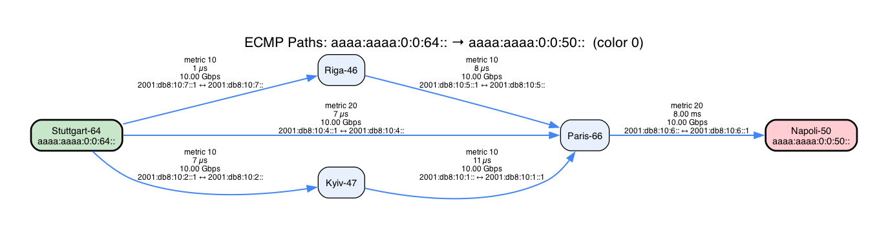

# get_ecmp_paths.py

Retrieves ECMP (Equal-Cost Multi-Path) paths from Cisco Crosswork Path Analytics using the gRPC API via `grpcurl`. Displays hop-by-hop path details including IGP metrics, delay, and bandwidth in a formatted tabular report.

## Requirements

- Python 3.x
- `requests` library
- `urllib3` library
- `graphviz` Python library (for `--graph` option)
- Graphviz `dot` command (for `--graph` option)
- `grpcurl` CLI tool (must be available on PATH)
- `pa.protoset` protobuf descriptor set file

Install Python dependencies:
```bash
pip install requests urllib3 graphviz
```

Install grpcurl:
```
https://github.com/fullstorydev/grpcurl
```

## Usage

```bash
python get_ecmp_paths.py -s <source_ip> -d <destination_ip> -c <color> [OPTIONS]
```

### Required Arguments

| Argument | Description |
|----------|-------------|
| `-s`, `--source` | Source IP address (IPv4 or IPv6) |
| `-d`, `--destination` | Destination IP address (IPv4 or IPv6) |
| `-c`, `--color` | SR-TE color value (integer) |

### Optional Arguments

| Argument | Default | Description |
|----------|---------|-------------|
| `--raw` | off | Print raw verbose `grpcurl` output instead of tabular format |
| `--graph` | off | Generate a Graphviz topology graph to the given filename (format inferred from extension, e.g. `.png`, `.svg`, `.pdf`) |
| `--ip` | `198.18.134.219` | Crosswork Network Controller IP address |
| `-u`, `--username` | `admin` | Authentication username |
| `-p`, `--password` | `PASSWORD` | Authentication password |
| `--port` | `30603` | gRPC port on the Crosswork controller |
| `--protoset` | `pa.protoset` | Path to the protobuf descriptor set file |

## Workflow

1. **Validate Inputs** — Validates that the source and destination are well-formed IPv4 or IPv6 addresses.
2. **Authenticate** — Obtains a TGT from the Crosswork SSO endpoint, then exchanges it for a JWT bearer token.
3. **Build gRPC Request** — Encodes source/destination IPs into the Path Analytics protobuf format (IPv4 as uint32, IPv6 as base64-encoded bytes) and includes the SR-TE color.
4. **Invoke grpcurl** — Calls the `rca.analytics.PathAnalytics/GetPaths` gRPC service via the `grpcurl` CLI tool with the JWT token for authorization.
5. **Display Results** — Parses the JSON response and renders a tabular report showing each ECMP path with per-hop link details, or prints raw `grpcurl` output if `--raw` is specified.
6. **Generate Graph** *(optional)* — If `--graph` is specified, builds a Graphviz directed graph of the topology with labelled edges (metric, delay, bandwidth) and renders it to the given file. Source and destination nodes are highlighted in green and red respectively.

## Examples

**Basic ECMP path query (IPv4):**
```bash
python get_ecmp_paths.py -s 199.20.53.72 -d 199.20.53.71 -c 131
```

**Query with custom Crosswork IP:**
```bash
python get_ecmp_paths.py -s 199.20.53.72 -d 199.20.53.71 -c 131 --ip 10.56.112.158
```

**IPv6 source and destination:**
```bash
python get_ecmp_paths.py -s 2001:db8::1 -d 2001:db8::2 -c 100
```

**Raw grpcurl output for debugging:**
```bash
python get_ecmp_paths.py -s 2001:db8::1 -d 2001:db8::2 -c 100 --raw
```

**Custom port and credentials:**
```bash
python get_ecmp_paths.py -s 199.20.53.72 -d 199.20.53.71 -c 131 --port 30604 -u operator -p secret
```

**Generate a PNG topology graph:**
```bash
python get_ecmp_paths.py -s 199.20.53.72 -d 199.20.53.71 -c 131 --graph topology.png
```

**Generate an SVG topology graph:**
```bash
python get_ecmp_paths.py -s 199.20.53.72 -d 199.20.53.71 -c 131 --graph topology.svg
```

## API Endpoints Used

| Endpoint | Protocol | Purpose |
|----------|----------|---------|
| `https://<ip>:30603/crosswork/sso/v1/tickets` | REST | Obtain TGT authentication ticket |
| `https://<ip>:30603/crosswork/sso/v1/tickets/{tgt}` | REST | Exchange TGT for JWT bearer token |
| `<ip>:30603 rca.analytics.PathAnalytics/GetPaths` | gRPC | Retrieve ECMP path entries |

## Output Format

In the default (non-raw) mode, each path entry is displayed as a table with the following columns:

| Column | Description |
|--------|-------------|
| Hop | Hop number along the path |
| From | Local node name |
| To | Remote node name |
| Interface Address | IPv4/IPv6 address of the local interface |
| Neighbor Address | IPv4/IPv6 address of the remote interface |
| Metric | IGP metric for the link |
| Delay | Minimum unidirectional delay (µs / ms / s) |
| Bandwidth | Maximum link bandwidth (bps / Kbps / Mbps / Gbps / Tbps) |

A path-level summary follows each table, showing propagation delay (min/avg/max) and path capacity (min/estimated) when available.

## Example Output

```bash
python get_ecmp_paths.py -s 'aaaa:aaaa:0:0:64::' -d 'aaaa:aaaa:0:0:50::' -c 0 --ip 10.58.239.120 -u admin -p ****
```

```
  ECMP Paths: aaaa:aaaa:0:0:64:: → aaaa:aaaa:0:0:50:: │ Color: 0
  ════════════════════════════════════════════════════════════════════════════════════════════════

  Path 1 of 1 │ Stuttgart-64 (aaaa:aaaa:0:0:64::) → Napoli-50 (aaaa:aaaa:0:0:50::)
  Metric: 40 │ Hops: 6 │ ECMP Width: 3 │ Timestamp: 2026-03-10T08:11:46.354358100Z

    Hop  From          To         Interface Address  Neighbor Address  Metric  Delay    Bandwidth
    ───  ────────────  ─────────  ─────────────────  ────────────────  ──────  ───────  ──────────
    1    Riga-46       Paris-66   2001:db8:10:5::1   2001:db8:10:5::   10      8 µs     10.00 Gbps
    2    Kyiv-47       Paris-66   2001:db8:10:1::    2001:db8:10:1::1  10      11 µs    10.00 Gbps
    3    Stuttgart-64  Riga-46    2001:db8:10:7::1   2001:db8:10:7::   10      1 µs     10.00 Gbps
    4    Stuttgart-64  Kyiv-47    2001:db8:10:2::1   2001:db8:10:2::   10      7 µs     10.00 Gbps
    5    Stuttgart-64  Paris-66   2001:db8:10:4::1   2001:db8:10:4::   20      7 µs     10.00 Gbps
    6    Paris-66      Napoli-50  2001:db8:10:6::    2001:db8:10:6::1  20      8.00 ms  10.00 Gbps

    Path Delay: 8.01 ms (min) / 8.01 ms (avg) / 8.02 ms (max)
    Path Capacity: 10.00 Gbps (min) / 10.00 Gbps (est)
```

## Example Graph Output

```bash
python get_ecmp_paths.py -s 'aaaa:aaaa:0:0:64::' -d 'aaaa:aaaa:0:0:50::' -c 0 --ip 10.58.239.120 -u admin -p **** --graph topology.png
```



The graph shows the three ECMP paths from Stuttgart-64 to Napoli-50 via Paris-66: one through Riga-46, one through Kyiv-47, and a direct higher-metric link. Each edge is labelled with the IGP metric, delay, bandwidth, and interface addresses. Source and destination nodes are highlighted in green and pink respectively.

## Error Handling

| Error | Behavior |
|-------|----------|
| Invalid source or destination IP address | Prints error message, exits with code 1 |
| HTTP errors during authentication (401, 403, 500, etc.) | Prints HTTP status and response body, exits with code 1 |
| Connection refused / unreachable host | Prints connection error message, exits with code 1 |
| `grpcurl` not found on PATH | Prints install instructions, exits with code 1 |
| `grpcurl` returns non-zero exit code | Prints stderr from `grpcurl`, exits with non-zero code |
| Invalid JSON in gRPC response | Prints parse error and raw output, exits with code 1 |

## Notes

- SSL certificate verification is disabled to support self-signed certificates.
- The default Crosswork IP, username, and password are hardcoded as constants at the top of the script for lab/demo convenience. Override them with CLI arguments for production use.
- Both IPv4 and IPv6 addresses are supported. IPv4 addresses are encoded as unsigned 32-bit integers; IPv6 addresses are base64-encoded 16-byte values.
- The `pa.protoset` file must be present in the working directory (or specified via `--protoset`). This file contains the compiled protobuf service definitions for Path Analytics.
- Default port is **30603** for both REST authentication and gRPC API calls.
- Use `--raw` mode for debugging to see the full gRPC request/response exchange.
